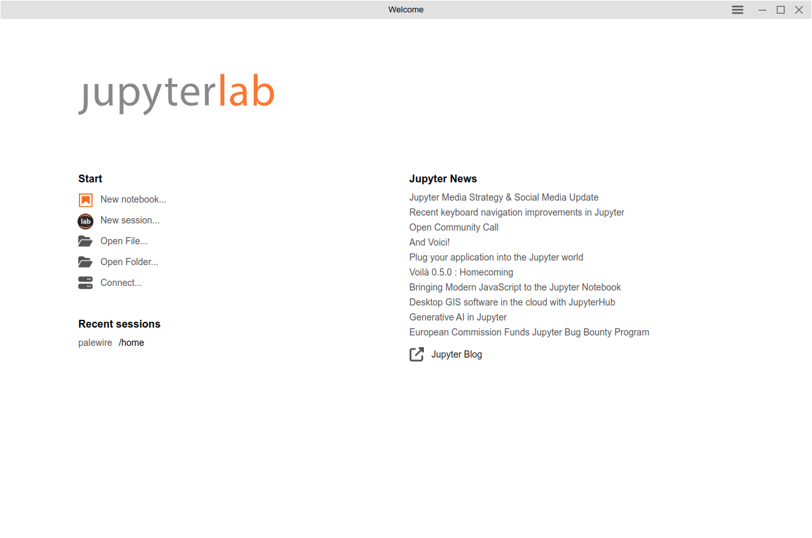
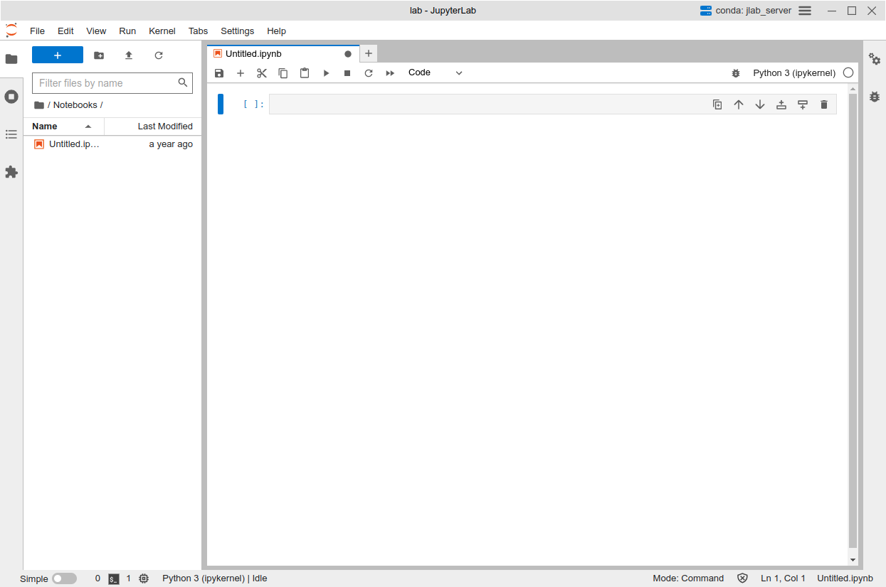

# First Automated Chart

Learn how you can use [Python](https://www.python.org/) and the [Datawrapper](https://developer.datawrapper.de/docs/getting-started) API to create a limitless number of charts and maps.

## What this class covers

* How to create an key that allows you to edit charts using the Datawrapper API
* How to use a Jupyter notebook and the Python `datawrapper` library to create a chart
* How to write a template function that creates a chart for each item in a list
* How to create a chart that updates on a schedule 

## What you need

If you've brave enough to use your computer’s command-line interface and give the Python programming language a try, you are qualified.

## Table of contents

* [Create a Datawrapper API key](#create-a-datawrapper-api-key)
* [Getting started with Project Jupyter](#getting-started-with-project-jupyter)
* [Connect to the Datawrapper API](#connect-to-the-datawrapper-api)
* [Import data](#import-data)
* [Create one chart](#create-one-chart)
* [Create many charts](#create-many-charts)
* [Create a scheduled chart](#create-a-chart-that-runs-on-a-schedule)

## Create a Datawrapper API key

The first step is to create an API key that will allow you to create and edit charts using the Datawrapper API. This is a simple process that can be done in a few clicks. It all begins at the Datawrapper homepage at [datawrapper.de](https://www.datawrapper.de/).

[](https://www.datawrapper.de/)

Hit the "Login" button in the upper right corner of the screen.


If you already have an account, enter your email and password to log in. If you don't, click the "Create a new account" button at the bottom of the form. If you m ake a new account, be sure to confirm your email address when Datawrapper sends you a message.

Once you are logged in, you should see a page that looks like this:


Hover on the menu icon in the upper right corner of the screen and click "Settings."


That will drop you on the setting page. Here you want to click on the "API Tokens" link in the left-hand navigation.


```{note}
If you made a new account and haven't confirmed your email address, you will see an error message. Check your email for a message from Datawrapper and click the link to confirm your account.
```

On the next page, hit the "Create new Access Token" button.


That will bring up a form. You should give your token a name that will help you remember what it's for. For instance, you might call it "First Automated Chart." Then click all of the permissions checkboxes. This will allow your token to do everything it needs to do. Then hit the "Generate token" button at the bottom.


That will bring you to a new page with your token printed in the middle. It will look something like the following, though I have redacted the actual token for security reasons. You should copy this token and save it in a safe place. It is the key you will need to use the Datawrapper API.


## Getting started with Project Jupyter

A [Jupyter notebook](http://jupyter.org/) is a browser-based interface where you can write, run, remix and republish code.

It is free software you can install and run like any other open-source library. It is used by scientists, scholars, investors and corporations to create and share their research. It is also used by journalists to develop stories and show their work.

There are numerous ways to install and configure Jupyter notebooks. Since this tutorial is designed for beginners, it will demonstrate how to use [JupyterLab Desktop](https://github.com/jupyterlab/jupyterlab-desktop), a self-contained application that provides a ready-to-use Python environment with several popular libraries bundled in. It can be installed on any operating system with a simple point-and-click interface.

The first step is to visit [JupyterLab Desktop’s homepage on GitHub](https://github.com/jupyterlab/jupyterlab-desktop) in your web browser.

[]((https://github.com/jupyterlab/jupyterlab-desktop))

Scroll down to the documentation below the code until you reach the Installation section.


Then pick the link appropriate for your operating system. The installation file is large so the download might take a while.

Find the file in your downloads directory and double click it to begin the installation process. Follow the instructions presented by the pop-up windows, sticking to the default options.

```{note}
Your computer’s operating system might flag the JupyterLab Desktop installer as an unverified or insecure application. Don’t worry. The tool has been vetted by Project Jupyter’s core developers and it’s safe to use.

If your system is blocking you from installing the tool, you’ll likely need to work around its barriers. For instance, on MacOS, this might require visiting your system’s security settings to allow the installation.
```

Once the program is installed, you can accept the installation wizard’s offer to immediately open the program, or you can search for “Jupyter Lab” in your operating system’s application finder.

That will open up a new window that looks something like this:



Now click the "New notebook..." button to open the Python interface. It will open up the notebook with an empty cell, which is where you can write and run your code.



The remainder of this class will assume you know how to enter code into cells and execute them in the notebook. If you don't, don't worry. It's very easy. You can quickly learn how by working through the introductory chapter of ["First Python Notebook"](https://palewi.re/docs/first-python-notebook/notebook.html), another open-source course available on this site.

From here on out, you can follow along with the code examples in this notebook. You can also copy and paste the code into your own notebook and run it there.

## Connect to the Datawrapper API

The `datawrapper` Python library, created by the authors of this class, is a simple tool that allows you to interact with the Datawrapper API using Python. It is available for free on the [Python Package Index](https://pypi.org/project/datawrapper/), a repository of open-source software that can be installed in your Jupyter Desktop environment with a single command in the first cell.

```bash
!pip install git+https://github.com/chekos/Datawrapper.git#egg=datawrapper
```

Once that's installed, you can import it into your notebook.

```python
from datawrapper import Datawrapper
```

The key first step is to authenticate with the Datawrapper API using the token you created earlier. You can do that by creating a new `Datawrapper` object and passing your token to it. We will save that as a variable named `dw`.

```python
dw = Datawrapper("YOUR ACCESS TOKEN")
```

We can verify that our connection is working by asking the `dw` object to tell us about the account.

```python
dw.get_my_account()
```

It should return a dictionary with information about the account, including the user's email address and role. It will look something like this:

```python
{'id': 696724,
 'email': 'b+nicar24@palewi.re',
 'name': None,
 'role': 'editor',
 'language': 'en-US',
 'presenceColor': None,
 'avatar': None,
 'teams': [],
 'chartCount': 0,
 'url': '/v3/users/696724',
 'entitlements': {}}
```

If an error appears, you'll need to verify that you have entered your token correctly. If you are sure you have, you might need to check that your token has the correct permissions. It should have all of the permissions checked when you created it.

## Import data

Now that we're connected to Datawrapper, it's time to introduct the data that we'll use to create our charts. We'll use a dataset of arrests in Baltimore, Maryland, that is available [on the city's data portal](https://data.baltimorecity.gov/datasets/baltimore::bpd-arrests/about). To speed up the class, we've created [a simplified version](https://raw.githubusercontent.com/palewire/first-automated-chart/main/_notebooks/arrests.csv) for use here.

We'll read in the data using the `pandas` library, which is a popular tool for working with data in Python. Before you can use it, you'll need to install it in your Jupyter Desktop environment using the same technique you used to install the `datawrapper` library.

```bash
!pip install pandas
```

Now it can be imported into your notebook.

```python
import pandas as pd
```

We'll read in the data using the `read_csv` function and save it as a variable named `df`.

```python
df = pd.read_csv(
    "https://raw.githubusercontent.com/palewire/first-automated-chart/main/_notebooks/arrests.csv",
    parse_dates=["ArrestDateTime"]
)
```

That can be inspected by running the `head` method on the `df` object, which will show the first five rows.

```python
df.head()
```

You can see that the dataset features one row for each arrest, with columns for the date and time of the arrest, the district where it occurred and the charge that was filed.

## Create one chart

With these materials, any number of charts could be created. As a simple start, lets consider a chart that shows the number of arrests in Baltimore by year. We could look into the idea by creating a new column in the `df` object that contains the year of each arrest.

```python
df['year'] = df.ArrestDateTime.dt.year
```

And then we could count the tally of arrests in each year.

```python
df.year.value_counts()
```

That will return some eye-opening numbers. It looks like the number of arrests in Baltimore has been falling over the years, exactly the kind of thing we might want to visualize with a chart.

```python
2010    45224
2011    43364
2012    42333
2013    39542
2014    37078
2015    25732
2016    23089
2017    21989
2018    20543
2019    19407
2023    13566
2020    13162
2022    12360
2021    11130
Name: year, dtype: int64
```

Before we can pass our data into Datawrapper, we need to reshape it into a pandas DataFrame, the kind of data structure that our Python library expects. We can do that by calling the `sort_index` and `reset_index` methods on the end of the `value_counts` method.

```python
totals_by_year = df.year.value_counts().sort_index().reset_index()
```

That should output a tidy table that's ready for the API. The only other things you need to make a basic chart are a title and a chart type. You can write whatever headline you like, but every chart type has a strict code name that you can find in the [Datawrapper documentation](https://developer.datawrapper.de/docs/chart-types).

[](https://developer.datawrapper.de/docs/chart-types)

In this case, the data seems well suit for a column chart, with one vertical bar for each year's arrest total. The documentation tells us that the code for that is "column-chart."

Connecting to the API and creating your first chart is as simple as passing our three required inputs — a headline, a chart type and a DataFrame — into the `create_chart` method of the `dw` object.

That can be done with the following code. While it's not required, we'll save the result as a variable named `chart_config` so that we can reuse what it returns.

```python
chart_config = dw.create_chart(
    title="Baltimore Arrests",
    chart_type="column-chart",
    data=totals_by_year
)
```

If the cell runs without error, a new chart is born. You can see it by visiting [https://app.datawrapper.de/](https://https://app.datawrapper.de/) in your logged in browser.


Congratulations! You've created your first chart using the Datawrapper API. While it's ready for review in the dashboard, it won't be published by default. Let's learn how to do that next.

Back in our notebook, the method returned a dictionary with information about the chart that was created. You can inspect it by running the variable name in a new cell.

```python
chart_config
```

It should spit out a dictionary with a ton of metadata about your chart. The most important bit is the "id" key, which contains the unique identifier for your chart. We can use that to make future edits to the chart. Let's pull it out into a variable named `chart_id`.

```python
chart_id = chart_config["id"]
```

Sending your chart live is as simple as passing the `chart_id` to the `publish_chart` method of the `dw` object, like so:

```python
dw.publish_chart(chart_id)
```

That will make the chart available to the public and return another dictionary of data, which you can ignore.

You can see your handiwork in the notebook by asking the `dw` object to display the chart's embed using the `display_chart` method.

```python
dw.display_chart(chart_id)
```

<iframe title="Baltimore Arrests" aria-label="Column Chart" id="datawrapper-chart-JBvvU" src="https://datawrapper.dwcdn.net/JBvvU/1/" scrolling="no" frameborder="0" style="width: 0; min-width: 100% !important; border: none;" height="400" data-external="1"></iframe><script type="text/javascript">!function(){"use strict";window.addEventListener("message",(function(a){if(void 0!==a.data["datawrapper-height"]){var e=document.querySelectorAll("iframe");for(var t in a.data["datawrapper-height"])for(var r=0;r<e.length;r++)if(e[r].contentWindow===a.source){var i=a.data["datawrapper-height"][t]+"px";e[r].style.height=i}}}))}();
</script>

### Set the chart description

A common practice in data journalism is to provide a citation of the sourcing of the data behind a chart. This is often done in the "Describe" tab of the Datawrapper interface. You can also do it using the `update_description` method of the `dw` object. Here we'll set the source name, source URL and byline.

```python
dw.update_description(
    chart_id,
    source_name="OpenBaltimore",
    source_url="https://data.baltimorecity.gov/datasets/baltimore::bpd-arrests/about",
    byline="First Automated Chart",
)
```

Run that cell and republish your chart.

```python
dw.publish_chart(chart_id)
```

You can see the changes by, again, asking the `dw` object to display the chart's embed.

```python
dw.display_chart(chart_id)
```

<iframe title="Baltimore Arrests" aria-label="Column Chart" id="datawrapper-chart-gX01J" src="https://datawrapper.dwcdn.net/gX01J/2/" scrolling="no" frameborder="0" style="width: 0; min-width: 100% !important; border: none;" height="400" data-external="1"></iframe><script type="text/javascript">!function(){"use strict";window.addEventListener("message",(function(a){if(void 0!==a.data["datawrapper-height"]){var e=document.querySelectorAll("iframe");for(var t in a.data["datawrapper-height"])for(var r=0;r<e.length;r++)if(e[r].contentWindow===a.source){var i=a.data["datawrapper-height"][t]+"px";e[r].style.height=i}}}))}();
</script>

### Style the chart

You can much more than that by using Python to configure the chart's metadata. There are literally dozens of different ways to customize axis labels, annotations, colors, legends, lines, bars and much more. A simple example is to change the color of the bars to match the IRE's accent color.

That can be done by creating a dictionary of metadata to the `metadata` parameter of the `update_chart` method. Here we'll set the "base-color" to the IRE's accent color, which is a nice shade of orange. It must conform precisely with the format expected by Datawrapper's API.

```python
metadata = {
    "visualize": {
        "base-color": "#bf7836"  # IRE's accent color
    }
}
```

That can then be passed to the `update_chart` method of the `dw` object, which will apply the changes to the chart.

```python
dw.update_chart(chart_id, metadata=metadata)
```

Then if you publish the chart...

```python
dw.publish_chart(chart_id)
```

...and display it again...

```python
dw.display_chart(chart_id)
```

...you should see the bars have changed color.

<iframe title="Baltimore Arrests" aria-label="Column Chart" id="datawrapper-chart-0Gjt5" src="https://datawrapper.dwcdn.net/0Gjt5/2/" scrolling="no" frameborder="0" style="width: 0; min-width: 100% !important; border: none;" height="400" data-external="1"></iframe><script type="text/javascript">!function(){"use strict";window.addEventListener("message",(function(a){if(void 0!==a.data["datawrapper-height"]){var e=document.querySelectorAll("iframe");for(var t in a.data["datawrapper-height"])for(var r=0;r<e.length;r++)if(e[r].contentWindow===a.source){var i=a.data["datawrapper-height"][t]+"px";e[r].style.height=i}}}))}();
</script>

## Create many charts

```python
df.head()
```

```python
df.District.value_counts()
```

```python
def create_chart(district: str):
    district_df = df[df.District == district]
    district_by_year = district_df.year.value_counts().sort_index().reset_index()
    chart_config = dw.create_chart(
        title=f"Arrests in Baltimore's {district} District",
        chart_type="column-chart",
        data=district_by_year,
        metadata={
            "visualize": {
                "base-color": "#113421"  # IRE's accent color
            }
        }
    )
    chart_id = chart_config["id"]
    dw.update_description(
        chart_id,
        source_name="OpenBaltimore",
        source_url="https://data.baltimorecity.gov/datasets/baltimore::bpd-arrests/about",
        byline="Ben Welsh",
    )

    dw.publish_chart(chart_id)
    return dw.display_chart(chart_id)
```

```python
create_chart("Western")
```

```python
chart_list = []
for district in df.District.dropna().unique():
    print(f"Creating chart for the {district} District")
    c = create_chart(district)
    chart_list.append(c)
```

```python
from IPython.display import display
```

```python
display(*chart_list)
```

## Create a chart that runs on a schedule

```python
from datetime import timedelta
```

```python
df.ArrestDateTime.max()
```

```python
seven_days_ago = df.ArrestDateTime.max() - timedelta(days=7)
```

```python
last_week_df = df[df.ArrestDateTime >= seven_days_ago]
```

```python
last_week_df.ChargeDescription.value_counts()
```

```python
top_charges_df = (
    last_week_df.ChargeDescription.value_counts()
        .reset_index()
        .head(10)
)
```

```python
chart_config = dw.create_chart(
    title=f"Top 10 arrest charges in Baltimore last week",
    chart_type="d3-bars",
    data=top_charges_df,
    metadata={
        "visualize": {
            "base-color": "#113421",
            "thick": True,
        },
        "describe": {
            "source-name": "OpenBaltimore",
            "source-url": "https://data.baltimorecity.gov/datasets/baltimore::bpd-arrests/about",
            "byline": "Ben Welsh"
        }
    }
)
```

```python
chart_id = chart_config["id"]
```

```python
dw.publish_chart(chart_id)
```

```python
dw.display_chart(chart_id)
```

## About this class

tk